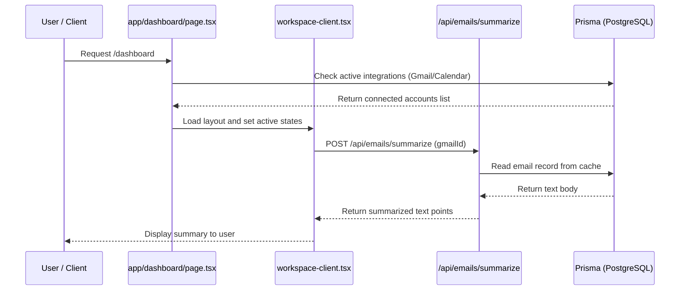

# Argon AI Command Center: Technical UI & Routing Specification

This document provides a highly detailed, pointwise, and image-wise specification of the **Argon AI Command Center** (also referred to as Corsair Command Center) dashboard, routing structures, and core application workflows. This reference is designed to assist in implementing or refining the UI and routing codebases.

---

## 1. Application & Architectural Overview

The Argon AI Command Center is an enterprise-grade, multi-tenant productivity platform designed to index and query personal workspace communication channels (like Gmail and Google Calendar) and execute automated AI actions.

### 💻 Tech Stack & Dependencies
* **Core Framework**: Next.js (App Router) using dynamic client/server rendering models.
* **Component Framework**: React 19 and Tailwind CSS for layout styling.
* **Design Elements**: Shadcn UI components (Dialogs, Cards, Command Palette) and Lucide React for theme-based icons.
* **Database & Persistence**: Prisma ORM connecting to a PostgreSQL schema.
* **Authentication**: Better Auth / NextAuth supporting OAuth flows for Gmail and Google Calendar.
* **AI Integration**: Vercel AI SDK using Google's Gemini models (Gemini 3.1 Flash-Lite / 1.5 Flash).

### 🔑 Security & Multi-Tenancy
* **Tenant Isolation**: Direct database filtering on `tenantId` (linked directly to the authenticated user's `session.user.id`).
* **Encryption Layer**: Secure index caches are encrypted using a system environment key (`CORSAIR_KEK`) utilizing double-envelope database security mechanisms.

---

## 2. Directory Structure & Route Configurations

The application uses standard App Router directory conventions. Below is the pointwise route mapping of the workspace:

### 📁 File Routing Tree & Key Components
* **Base Layout**: [layout.tsx](file:///Users/priyanshu/Desktop/copy/corsair-command-center/app/layout.tsx) — Wraps base HTML, global theme providers, and site loaders.
* **Landing Route (`/`)**: [page.tsx](file:///Users/priyanshu/Desktop/copy/corsair-command-center/app/page.tsx) / [landing-client.tsx](file:///Users/priyanshu/Desktop/copy/corsair-command-center/app/landing-client.tsx) — Static/client landing page layouts.
* **Auth Routes (`/sign-in`, `/sign-up`)**: [sign-in/page.tsx](file:///Users/priyanshu/Desktop/copy/corsair-command-center/app/(auth)/sign-in/page.tsx) / [sign-up/page.tsx](file:///Users/priyanshu/Desktop/copy/corsair-command-center/app/(auth)/sign-up/page.tsx) — Standard user entry forms.
* **Dashboard Route (`/dashboard`)**: [dashboard/page.tsx](file:///Users/priyanshu/Desktop/copy/corsair-command-center/app/(protected)/dashboard/page.tsx) — Server component that queries database stats, sessions, and passes data to [workspace-client.tsx](file:///Users/priyanshu/Desktop/copy/corsair-command-center/app/(protected)/dashboard/workspace-client.tsx).
* **Workspace Client Tab Layout**: [workspace-client.tsx](file:///Users/priyanshu/Desktop/copy/corsair-command-center/app/(protected)/dashboard/workspace-client.tsx) — 69KB React client file containing states for:
  * Tab 1: **AI Assistant Workspace** (Active tab state: `"chat"`)
  * Tab 2: **Inbox Workspace** (Active tab state: `"inbox"`)
  * Tab 3: **Calendar Board** (Active tab state: `"calendar"`)
  * Tab 4: **Configuration Settings** (Active tab state: `"configuration"`, which redirects to settings)
* **Settings & Caches Route (`/settings`)**: [settings/page.tsx](file:///Users/priyanshu/Desktop/copy/corsair-command-center/app/(protected)/settings/page.tsx) — Configures service connections, indexes stats, webhooks, and live synchronization event logs.

---

## 3. UI Screen Breakdowns (Point-by-Point & Screenshot References)

### Screen A: Integration Grid Workspace Setup (Configuration)
The configuration viewport organizes external credentials into groups, allowing users to connect their active workspaces.

#### Point-by-Point Specs:
* **Layout Design**:
  * Left Sidebar navigation is standard across all dashboard viewports (collapsed width: `w-16`, expanded width: `w-64`).
  * Center column (Second navigation panel) features categorization options. "Overview" lists `Connected`, `Error`, and `Recommended` counts, followed by checkable categories (e.g. `Messaging & Support`, `E-commerce & Payments`, `CRM & Sales`).
  * Right Side displays the integration cards within a responsive CSS grid (`grid-cols-1 sm:grid-cols-2 lg:grid-cols-3 xl:grid-cols-4`).
* **Visual States & Badges**:
  * **Gmail Card**: Displays a red-theme envelope with a `Connected` status badge (emerald background pill). Includes a timestamp detailing when it was last refreshed (e.g., `Synced 2m ago`).
  * **Slack Card**: Represents an active transaction displaying a `Syncing` status badge (amber background pill) and a loading button text `Connecting...`.
  * **Airtable & HubSpot Cards**: Standard inactive states with `Connect` buttons and recommended markers.
  * **Amplitude Card**: Darkened template marked as `Coming Soon`.
* **Sidebar Profile**:
  * Bottom corner retains user profile metadata (Avatar image, username, user email) alongside an animated Theme Toggler and a Log Out action trigger.

---

### Screen B: Email Read & AI Integration Details
When an email is selected inside the workspace, a details viewport opens, displaying the sender metadata, email content, and contextual AI suggestions.

#### Point-by-Point Specs:
* **Page Layout**:
  * Three-column view containing:
    1. Sidebar navigation triggers.
    2. Sub-navigation listing workspace folders: `Inbox`, `Drafts`, `Sent`, `Spam`, `Trash`.
    3. Center panel for details, accompanied by an `Engram Assistant` chat interface on the right.
* **Email Detail Card**:
  * Renders with an elegant, card-based overlay showing sender name, receiver email address, and a formatted datetime line (e.g., `Thursday, June 18, 2026 at 04:38 AM`).
  * Clear visual separation using standard typography sizes and light horizontal divider rules.
* **AI Actions (Engram AI Assistant Actions)**:
  * Contains direct triggers: **Summarize with AI** and **Draft Reply via AI** buttons styled as rounded dark primary components.
  * Displays a right-side assistant pane greeting the user and presenting quick recommendations (e.g., `Gmail context scan`, `Zoom + Fireflies integration`, `Calendar availability`) based on the current context.

---

### Screen C: Workspace AI Assistant Chat & Processing Flow
The AI workspace updates dynamically during long-running tasks, providing users with feedback about background operations.

#### Point-by-Point Specs:
* **Layout Design**:
  * Displays the `Inbox` listing folder in the center panel (e.g., mail items for `TheBestPDF`, `Naukri Mltrks`, `Facebook`, etc.) with alert notifications.
  * Right column contains the processing state panel.
* **Live Action Log**:
  * Shows a detailed "Thinking..." logs layout indicating which databases have been parsed:
    * `Gmail checked` (marked with emerald checkmark)
    * `Zoom transcript checked` (marked with emerald checkmark)
    * `Notion notes checked` (marked with emerald checkmark)
    * `Searching Calendar content...` (shows a circular loader animation)
  * Below the logs, a summary block displays the request prompt (e.g., `"send an email to hiteshdhayal30@gmail.com, asking him when is he free this weekend"`) and shows the current active state (`Generating response draft...`).

---

### Screen D: AI Email Draft Editing & Actioning
After background checking completes, the assistant displays the generated draft within an editable workspace block.

#### Point-by-Point Specs:
* **Draft Box**:
  * Displays a card containing fields for `To` and `Subject` alongside the generated text.
  * Checks database items (such as "learning reminder at 10:00-10:30 AM") to customize the email draft.
* **Action Buttons**:
  * The bottom footer of the draft contains **Edit** and **Send Email** buttons. The **Send Email** button features a primary background theme with an icon, indicating that the action is ready to execute.

---

### Screen E: Inactive / Alternative Integrations Panel
This view shows a different selection of cards, indicating how empty states and sync options are handled when integrations are inactive.

#### Point-by-Point Specs:
* **Integrated Checkbox Categories**:
  * Sidebar filters dynamically filter cards based on user selection: `Messaging & Support`, `CRM & Sales`, etc.
* **OAuth Status Checking**:
  * Inactive states display clear card actions with `Connect` triggers that route users to OAuth endpoints (e.g., `/api/integrations/googlecalendar/connect`).
  * Active connections show a green badge, and recommended items feature a star badge.

---

## 4. Summary of App Routing & Actions Flow

Below is a sequence diagram displaying the internal data flows between the dashboard components and database:

---

## 5. UI Implementation & Styling Guidelines

To ensure consistency with the design layouts shown in the screenshots, implement the following guidelines:
1. **Theme Colors**:
   * Use dark mode-first slate palettes (`bg-background` set to hex `#0B0F13`, `bg-card` set to hex `#12181F`, with slate-800 borders).
   * **Badge Colors**: Use emerald pills (`text-emerald-400 bg-emerald-500/10`) for connected status and amber/orange pills for syncing actions.
2. **Typography**:
   * Use an Outfit/Inter sans-serif typeface for body copy and metadata.
   * Header typography (e.g., `Hello` title) uses a Georgia or Outfit Serif font, providing a clean contrast with metadata.
3. **Animations**:
   * Hover animations on navigation links use slide-up translation clone effects: `.group-hover:-translate-y-full` on the main text span and `.group-hover:translate-y-0` on the sliding cloned text span.
   * Accordion elements and question lists include a rotating SVG icon (`+` to `-`) with CSS transition transformations (`rotate-180` duration-300).
4. **Layout Spacing**:
   * Sidebar controls are aligned using `py-3 px-4` structures.
   * Integration lists are spaced using flex-row and flex-col layouts with a constant gap parameter (`gap-4` / `gap-6`).
