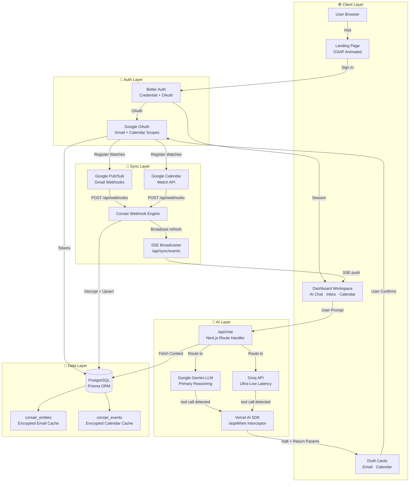
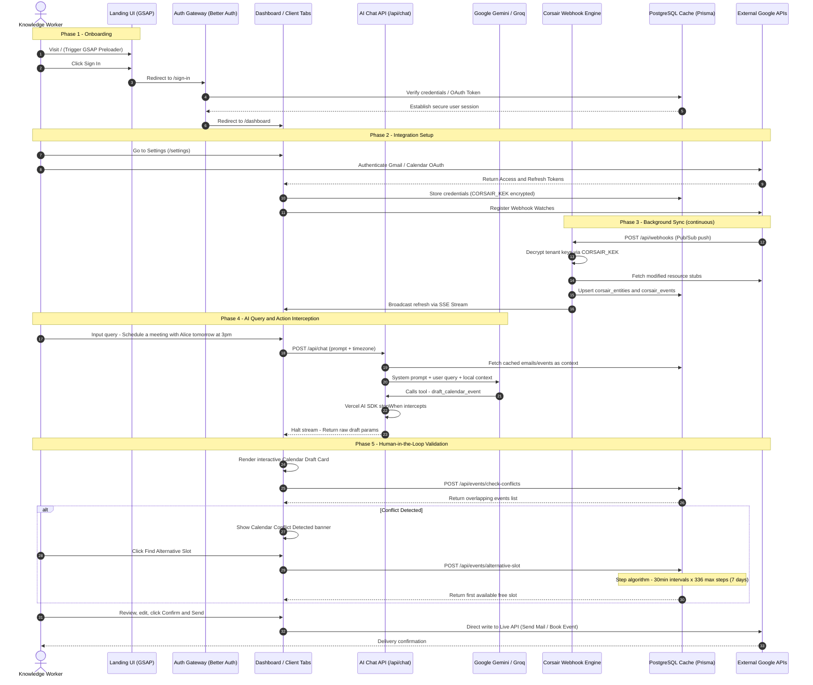
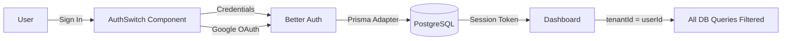
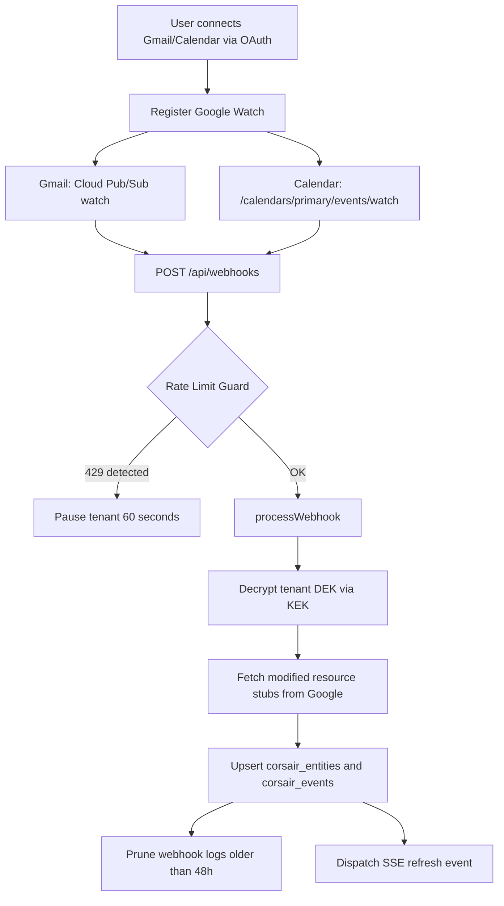

<div align="center">

# ⬡ ARGON AI

### *AI That Doesn't Just Answer. It Acts.*

[](https://nextjs.org/)
[](https://react.dev/)
[](https://www.typescriptlang.org/)
[](https://www.prisma.io/)
[](https://www.postgresql.org/)
[](https://tailwindcss.com/)

> **Argon AI** is an enterprise-grade AI executive assistant that integrates with Gmail and Google Calendar to summarize emails, draft replies, manage schedules, and automate workflows — all with a strict human-in-the-loop safety model.


</div>

---

## 📋 Table of Contents

- [The Problem](#-the-problem)
- [What Argon AI Does](#-what-argon-ai-does)
- [Architecture Overview](#-architecture-overview)
- [Complete Workflow](#-complete-workflow)
- [Technology Stack](#-technology-stack)
- [Core Subsystems](#-core-subsystems)
  - [Landing UI & GSAP Preloader](#1-landing-ui--gsap-preloader)
  - [Authentication (Better Auth)](#2-multi-tenant-authentication-better-auth)
  - [Real-Time Webhook Sync](#3-real-time-webhook-sync--corsair-engine)
  - [SSE Live Broadcast](#4-sse-live-broadcast-manager)
  - [Double-Envelope Encryption](#5-double-envelope-encryption-layer)
  - [AI Routing & Action Interception](#6-ai-routing--action-interception-engine)
  - [Conflict Validation Algorithms](#7-conflict-validation--alternative-slot-algorithms)
- [Application Routes](#-application-routes)
- [Database Schema](#-database-schema)
- [Key API Endpoints](#-key-api-endpoints)
- [Environment Variables](#-environment-variables)
- [Getting Started](#-getting-started)
- [Project Structure](#-project-structure)

---

## 🔍 The Problem

Modern knowledge workers face four critical friction points:

| # | Problem | Impact |
|---|---------|--------|
| 1 | **Context-Switching Tax** | Users waste focus toggling between Gmail, Google Calendar, task managers, and AI chatbots — splitting attention and leaking context |
| 2 | **Out-of-Context AI** | Standard AI assistants operate in isolation with no access to personal data (emails, events), producing generic, unhelpful responses |
| 3 | **Action Execution Anxiety** | Users cannot trust fully autonomous AI agents to send emails or book meetings — a single hallucination can cause irreversible damage |
| 4 | **Multi-Tenant Data Security** | Caching personal emails and calendars locally without strict per-user encryption exposes sensitive data to breaches |

---

## 💡 What Argon AI Does

Argon AI solves all four problems in a single cohesive platform:

- 🧠 **Unified Action Center** — Coordinates inbox feeds, calendar blocks, and an AI chat workspace in one glassmorphic pane
- 🛡️ **Human-in-the-Loop Interception** — AI never writes to external APIs directly; all write operations are paused and rendered as interactive Draft Cards for user review
- 📅 **Visual Conflict Resolution** — Auto-scans calendar conflicts and suggests alternative 30-minute slots across a 7-day window
- 🔐 **Secure Cache Isolation** — Double-envelope database encryption using per-tenant DEKs wrapped by a system-level KEK

---

## 🏗️ Architecture Overview

The following diagram maps the full data flow from user input to AI execution, webhook sync, and live dashboard updates:



---

## 🔄 Complete Workflow

The entire lifecycle from user visit to AI action execution:



---

## 💻 Technology Stack

| Technology | Category | Role |
|:-----------|:---------|:-----|
| **Next.js 16.2 (App Router)** | Core Framework | Server components, dynamic API routes, nested layouts (`/settings`, `/dashboard/[[...chatId]]`) |
| **React 19** | UI Library | Client state, custom ref hooks, server actions, layout rendering |
| **TypeScript 5** | Language | End-to-end type safety across API, database, and UI layers |
| **Tailwind CSS v4** | Styling | Glassmorphic design tokens, slate borders, responsive grid layouts |
| **GSAP 3** | Animation | Numeric countdown preloader, `SplitText` letter animations, cinematic entry |
| **Framer Motion 12** | Animation | Physics-based spring drawer toggling (`stiffness: 250`, `damping: 30`) |
| **Vercel AI SDK 6** | AI Orchestration | Text streaming, `stopWhen` tool interception, structured tool execution |
| **Google Gemini** | LLM (Primary) | Multi-step reasoning agent for complex queries and structured data extraction |
| **Groq API** | LLM (Secondary) | Ultra-low latency inference for fast text streams |
| **Corsair Framework** | Sync Engine | OAuth credential management, webhook processing, `@corsair-dev/mcp` MCP tools |
| **Better Auth 1.6** | Authentication | Password credentials, Google & GitHub OAuth, Prisma adapter integration |
| **Prisma 7.8** | ORM | Type-safe multi-tenant schema: `user`, `session`, `conversation`, `message`, `calendar_events`, `gmail_messages` |
| **PostgreSQL** | Database | Primary persistent store for all user data, encrypted caches, sync logs |
| **Server-Sent Events (SSE)** | Real-time | Streams database changes to active dashboard components without polling |
| **Shadcn UI** | Component Library | Dialogs, cards, command palette, popovers — all themed to glassmorphic dark mode |
| **Zod 4** | Validation | Runtime schema validation for API payloads and AI tool parameters |
| **TanStack Query 5** | Data Fetching | Client-side cache management and background refetching |

---

## ⚙️ Core Subsystems

### 1. Landing UI & GSAP Preloader

The landing page (`/`) delivers a cinematic first impression:

- **Preloader Counter** — GSAP animates a numeric countdown from `0` to `100` using custom ease curves. `SplitText` splits heading characters for staggered letter-by-letter reveals.
- **Double-Tap Theme Toggle** — Pointer listeners on the main wrapper detect double-click events to switch between light and dark themes using CSS mask-clip transitions.
- **Cursor-Tracking Spotlight Glows** — Mouse-move listeners update CSS custom properties (`--mouse-x`, `--mouse-y`) that feed radial gradient backgrounds on dashboard widgets, creating live cursor-following halos.

```
Landing Page Flow:
  Visit / → GSAP Preloader (0→100 counter) → SplitText reveal → Full page loads
  Double-tap anywhere → Theme toggles via CSS mask-clip animation
  Mouse move → CSS vars update → Spotlight glow follows cursor
```

---

### 2. Multi-Tenant Authentication (Better Auth)



- **Database Isolation** — Every API call parses the session header to extract `userId`, which acts as the `tenantId` for all downstream queries. Zero cross-tenant data leakage.
- **OAuth Scopes Connected**:
  - `https://www.googleapis.com/auth/gmail.modify` — Read, archive, draft, and send emails
  - `https://www.googleapis.com/auth/calendar` — Read, write, edit, and create calendar events
- **Session Persistence** — Tokens are securely persisted in the database with automatic refresh logic managed by the Corsair engine.

---

### 3. Real-Time Webhook Sync (Corsair Engine)



**Webhook Processing Steps:**
1. Resolve incoming Pub/Sub metadata → identify target `tenantId`
2. Rate-limit cooldown guard — `429 Too Many Requests` pauses that tenant's requests for 60 seconds
3. `processWebhook(corsair, headers, body)` updates local cache tables
4. Background pruning deletes webhook logs older than 48 hours
5. SSE channel receives a `{ type: "refresh", plugin }` broadcast

---

### 4. SSE Live Broadcast Manager

The `/api/sync/events` route maintains a persistent `text/event-stream` connection:

```
Client connects to SSE endpoint
  → Heartbeat chunk sent every 15 seconds (keep-alive)
  → Webhook sync completes
  → lib/sse.ts global manager broadcasts { type: "refresh", plugin }
  → All client sockets matching tenantId receive the event
  → Dashboard re-fetches affected data silently in background
```

This eliminates polling and delivers sub-second UI updates when emails arrive or calendar events change.

---

### 5. Double-Envelope Encryption Layer

All personal workspace data stored in `corsair_entities` is protected by two layers of encryption:

```
┌─────────────────────────────────────────────┐
│           CORSAIR_KEK (env secret)          │  ← System-level Key Encryption Key
│                    │                        │
│    ┌───────────────▼───────────────┐        │
│    │  DEK (unique per integration) │        │  ← Data Encryption Key (encrypted by KEK)
│    │       stored in DB            │        │     stored encrypted in database
│    └───────────────┬───────────────┘        │
│                    │                        │
│    ┌───────────────▼───────────────┐        │
│    │   User Data (emails, events)  │        │  ← Encrypted with DEK
│    │       data field in DB        │        │     DB leak only exposes ciphertext
│    └───────────────────────────────┘        │
└─────────────────────────────────────────────┘
```

**Security Properties:**
- A database administrator cannot read cached email bodies
- Cross-tenant data access is impossible — each tenant has a unique DEK
- The KEK lives only in the server environment, never in the database

---

### 6. AI Routing & Action Interception Engine

> **Core Safety Protocol: AI reasons, humans authorize.**

```
┌─────────────────────────────────────────────┐
│              User Sends Prompt              │
└───────────────────┬─────────────────────────┘
                    │
                    ▼
┌─────────────────────────────────────────────┐
│     LLM Reasoning Engine (Gemini/Groq)      │
│    + Local PostgreSQL context injected      │
└───────────────────┬─────────────────────────┘
                    │
           Tool call detected?
                    │
        ┌───────────┴──────────┐
       No                     Yes
        │              (draft_email /
        ▼           draft_calendar_event)
 Stream plain                 │
 text response                ▼
 to chat UI     ┌─────────────────────────────┐
                │ Vercel AI SDK stopWhen hook  │
                │  halts the assistant stream  │
                └─────────────┬───────────────┘
                              │
                              ▼
                ┌─────────────────────────────┐
                │  Return raw JSON params     │
                │  to dashboard client        │
                └─────────────┬───────────────┘
                              │
                              ▼
                ┌─────────────────────────────┐
                │  Render Interactive         │
                │  Draft Card (editable)      │◄── Conflict check runs
                └─────────────┬───────────────┘
                              │
                    User reviews and edits
                              │
                              ▼
                ┌─────────────────────────────┐
                │  User clicks "Confirm"      │
                │  → Live Google API Write    │
                └─────────────────────────────┘
```

**The `stopWhen` Configuration:**
```typescript
stopWhen: [
  hasToolCall('draft_email'),
  hasToolCall('draft_calendar_event'),
]
```

This forces streaming to halt the moment a write tool is detected — the raw parameters are returned to the client instead of continuing the stream.

**Draft Cards:**

| Card | Features |
|------|----------|
| **Email Draft Card** | Editable `To`, `Subject`, `Body` fields; file attachment support; AI tone refinement (Casual / Professional / Short / Long / Friendly) via `/api/emails/refine` |
| **Calendar Draft Card** | Step-by-step validation animation (Parsing → Checking availability → Analyzing conflicts); conflict alert banner; alternative slot suggestion |

---

### 7. Conflict Validation & Alternative Slot Algorithms

#### Conflict Check — `/api/events/check-conflicts`

```
1. Parse proposedStart and proposedEnd from request
2. Query PostgreSQL cache for overlapping events:
   
   Conflict exists when:
   startTime < proposedEnd  AND  endTime > proposedStart

3. Simultaneously query Google Calendar live API for primary calendar
4. Return: { hasConflict: boolean, conflictingEvents: Event[] }
```

#### Alternative Slot Stepper — `/api/events/alternative-slot`

```
1. Compute duration = proposedEnd - proposedStart
2. Fetch all events within [proposedStart, proposedStart + 7 days]
   from both PostgreSQL cache AND live Google Calendar API
3. Sort events chronologically
4. Initialize candidate = proposedStart
   Loop (max 336 iterations = 7 days x 48 slots/day):
     candidateEnd = candidate + duration
     For each event in sorted list:
       If event overlaps [candidate, candidateEnd]:
         candidate = event.endTime  ← skip past conflict
         break
     If no overlap found:
       return { suggestedStart: candidate, suggestedEnd: candidateEnd }
     candidate += 30 minutes
5. If no slot found after 336 steps: return null
```

---

## 🗺️ Application Routes

```
/                           → Landing page (GSAP animated)
/sign-in                    → Authentication (Better Auth)
/sign-up                    → Registration
/dashboard                  → Main workspace (redirects to /dashboard/[chatId])
/dashboard/[chatId]         → AI Chat tab (default active)
  ├── Tab: chat             → AI Assistant workspace
  ├── Tab: inbox            → Gmail inbox with email reader
  ├── Tab: calendar         → Google Calendar board view
  └── Tab: configuration    → Redirects to /settings
/settings                   → Integration management, webhook logs, sync stats
/privacy                    → Privacy policy
/terms                      → Terms of service

API Routes:
/api/chat                   → POST — AI streaming chat endpoint
/api/webhooks               → POST — Google Pub/Sub webhook receiver
/api/sync/events            → GET  — SSE live update stream
/api/emails/summarize       → POST — Summarize email with AI
/api/emails/refine          → POST — Refine email tone with AI
/api/events/check-conflicts → POST — Check calendar conflicts
/api/events/alternative-slot→ POST — Find next available time slot
/api/integrations/*/connect → GET  — OAuth connection flow per service
```

---

## 🗄️ Database Schema

Key Prisma models powering the platform:

```
User ─────────────┬── Session (auth sessions)
                  ├── Account (OAuth provider tokens)
                  ├── Conversation ─── Message[]
                  ├── corsair_entities (encrypted email cache)
                  └── corsair_events  (encrypted calendar cache)

corsair_entities:
  - id, tenantId, pluginId
  - data (encrypted JSON blob)
  - encryptedDek (DEK wrapped by CORSAIR_KEK)
  - lastSynced, createdAt

corsair_events:
  - id, tenantId, pluginId
  - startTime, endTime
  - data (encrypted JSON blob)
  - encryptedDek
  - lastSynced, createdAt
```

---

## 🔑 Key API Endpoints

### `POST /api/chat`
**Purpose:** Main AI reasoning endpoint with tool interception.

| Input | Type | Description |
|-------|------|-------------|
| `messages` | `Message[]` | Conversation history |
| `conversationId` | `string` | Active chat session ID |
| `timezone` | `string` | User's local timezone (for calendar ops) |

**Response:** Streaming text or halted JSON draft params when a write tool is triggered.

---

### `POST /api/webhooks`
**Purpose:** Receives Google Pub/Sub push notifications for Gmail and Calendar.

- Parses `tenantId` from query params or Pub/Sub metadata
- Applies rate-limit cooldown (60s pause on 429)
- Decrypts, fetches, and upserts to `corsair_entities` / `corsair_events`
- Broadcasts SSE refresh event to connected clients

---

### `GET /api/sync/events`
**Purpose:** Establishes persistent SSE connection for real-time dashboard updates.

- Emits heartbeat every 15 seconds
- Broadcasts `{ type: "refresh", plugin: string }` when webhooks complete

---

## 🔧 Environment Variables

```bash
# Database
DATABASE_URL="postgresql://..."

# Authentication
BETTER_AUTH_SECRET="..."
BETTER_AUTH_URL="http://localhost:3000"

# Google OAuth
GOOGLE_CLIENT_ID="..."
GOOGLE_CLIENT_SECRET="..."

# AI Providers
GOOGLE_GENERATIVE_AI_API_KEY="..."
GROQ_API_KEY="..."

# Corsair Sync Engine
CORSAIR_API_KEY="..."
CORSAIR_KEK="..."          # 32-byte hex — Master Key Encryption Key

# Google Pub/Sub (Webhook delivery)
GOOGLE_PUBSUB_TOPIC="projects/your-project/topics/your-topic"
```

See [`.env.example`](./.env.example) for the full list with descriptions.

---

## 🚀 Getting Started

### Prerequisites

- Node.js 20+
- PostgreSQL database
- Google Cloud project with Gmail API and Google Calendar API enabled
- Google Cloud Pub/Sub topic configured for Gmail push subscriptions

### Installation

```bash
# 1. Clone the repository
git clone https://github.com/your-username/argon-ai.git
cd argon-ai

# 2. Install dependencies
pnpm install

# 3. Configure environment variables
cp .env.example .env
# Fill in all required values in .env

# 4. Initialize the database
pnpm prisma migrate dev

# 5. Start the development server
pnpm dev
```

Open [http://localhost:3000](http://localhost:3000) in your browser.

### Production Build

```bash
pnpm build
pnpm start
```

---

## 📁 Project Structure

```
argon-ai/
├── app/
│   ├── (auth)/
│   │   ├── sign-in/              # Login page
│   │   └── sign-up/              # Registration page
│   ├── (protected)/
│   │   ├── dashboard/
│   │   │   ├── [[...chatId]]/    # Dynamic chat route
│   │   │   ├── components/
│   │   │   │   ├── EmailDraftCard.tsx     # Editable email draft UI
│   │   │   │   └── CalendarDraftCard.tsx  # Conflict-aware calendar UI
│   │   │   └── workspace-client.tsx       # Main 4-tab workspace layout
│   │   └── settings/             # Integration management UI
│   ├── api/
│   │   ├── chat/route.ts         # AI streaming endpoint
│   │   ├── webhooks/route.ts     # Google Pub/Sub receiver
│   │   ├── sync/events/route.ts  # SSE broadcaster
│   │   ├── emails/
│   │   │   ├── summarize/        # AI email summarization
│   │   │   └── refine/           # AI tone refinement
│   │   └── events/
│   │       ├── check-conflicts/  # Calendar overlap detection
│   │       └── alternative-slot/ # Slot stepping algorithm
│   ├── landing-client.tsx        # GSAP animated landing page
│   └── layout.tsx                # Root layout with providers
├── components/
│   └── ui/                       # Shadcn + custom components
├── features/                     # Feature-scoped logic modules
├── hooks/                        # Custom React hooks
├── lib/
│   ├── auth.ts                   # Better Auth configuration
│   ├── corsair.ts                # Corsair engine client wrapper
│   ├── prisma.ts                 # Prisma client singleton
│   └── sse.ts                    # SSE global broadcast manager
├── prisma/
│   └── schema.prisma             # Database schema definitions
├── public/
│   └── readme/
│       └── home.png              # Landing page screenshot
└── .env.example                  # Environment variable template
```

---

<div align="center">

**Built with Next.js, Vercel AI SDK, and the Corsair Sync Framework**

*Argon AI — Where intelligence meets execution.*

</div>
